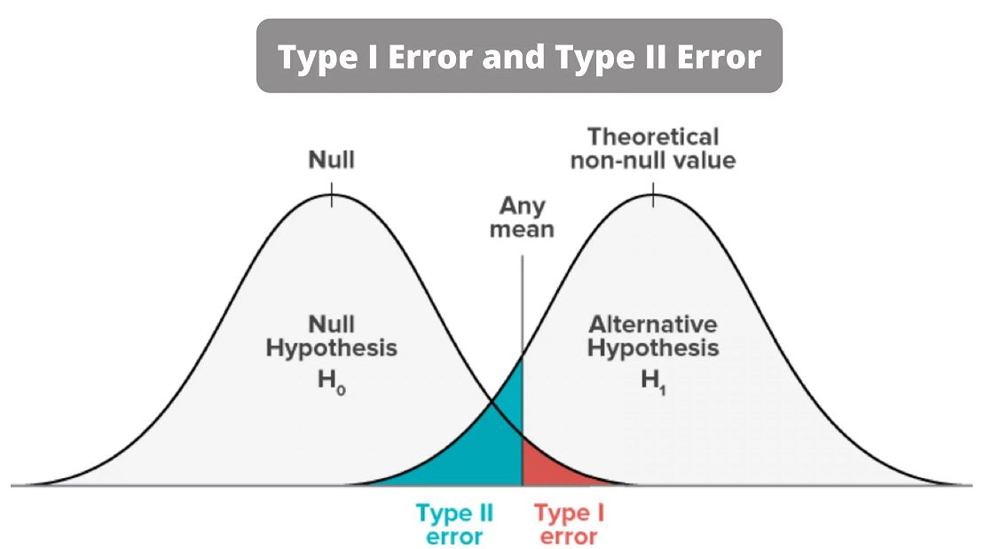

```{r message=FALSE, warning=FALSE, include=FALSE}
library(magrittr)
library(dplyr)
library(ggplot2)
library(gridExtra)
library(ggpubr)
library(bookdown)
library(plotly)
library(rstanarm)
library(Cairo)
library(rgl)
library(plot3D)
library(effects)
library(MASS)
library(car)
library(faraway)
library(leaps)
library(ROCR)
library(RColorBrewer)
library(ISLR2)
library(e1071)
library(class)
library(reshape2)
library(sads)
library(knitr)
library(latex2exp)
library(GGally)
library(combinat)
library(superheat)
library(stringr)
library(purrr)
library(tidyr)
library(lubridate)
library(ggthemes)
library(kableExtra)
library(covr)
```


```{r setup, include=FALSE}
knitr::opts_chunk$set(echo = TRUE)
```


# Excercise 1 - Risiko! is back, with friends

In the first exercise we deal with a dataset containing different information about board games. The variables are really intuitive, I will focus on the description of the main ones:

- minplayers and maxplayers $\rightarrow$ the minimum and maximum allowed players for each game
- average_rating $\rightarrow$ a numerical value between 0 and 10 that indicates the average user game for each game
- average weight $\rightarrow$ the difficulty of the game in a broad sense
- playing time $\rightarrow$ how much a game last in average

## Point a)
```{r echo=FALSE, fig.height=3, fig.width=8, warning=FALSE}
df <- readRDS("~/Documents/GitHub/Computational-stat/Assignment 2/games_preprocessed.RDS")

ggplot(data=df, aes(y=playingtime, x=as.factor(minplayers)))+ # I wanted to look at some statistics of playing time,
                                                              # for different values of minplayers. Is more player associated 
                                                              # with more playing time
  geom_boxplot(outlier.colour="blue", outlier.shape=16,
             outlier.size=2, notch=FALSE, fill="lightblue")

```

It would also be interesting to see which are the best games for each level of difficulty (average_weight)

```{r echo=FALSE, warning=FALSE}
#create the dataset where average_weigth is not continuous anymore
df_plot = df 
df_plot$weight_bins= cut(df_plot$average_weight, breaks = c(0, 1, 2, 3, 4, 5), labels = c("0", "1", "2", "3", "4")) 


df_plot %>%
  group_by(weight_bins) %>%
  #select the top ten for each difficulty level
  top_n(10, average_rating) %>%
  ungroup %>%
  ggplot(aes(reorder(name, average_rating),average_rating, fill = weight_bins)) +
  geom_col(show.legend = FALSE) +
  labs(x = NULL, y = "tf-idf") +
  facet_wrap(~weight_bins, ncol = 3, scales = "free") +
  coord_flip() +
  theme_minimal() +
  theme(axis.text.y=element_text(size=rel(0.5)), axis.text.x = element_text(size = 6))+
  scale_fill_ptol()
```


## Point b)
```{r}
df= df[,-1:-2]
df=data.frame(scale(df))
```

```{r fig.width=6}
sample_cov=cov(df)
a = cor(df)
# We can get the same result using cov2cor

cor_matrix <- cov2cor(sample_cov)
cor_matrix <- round(cor_matrix, 2)

new_col_names <- c("YP", "mP", "MP", "PT", "mA", "AR", "TO", "AW")
colnames(cor_matrix) <- new_col_names
kable(cor_matrix, format = "markdown") %>%
  kable_styling()


```
Since we have scaled all the columns with variance equal to 1, it implies that the covariance-variance matrix is equal to the correlation matrix. Fonte: https://math.stackexchange.com/questions/3780344/under-what-conditions-will-the-covariance-matrix-be-identical-to-the-correlation

## Point c)
```{r}
set.seed(123)
B=1000

cov_var_sample=array(NA, dim=c(ncol(df),ncol(df),B))

# fill in the array with cov-var matrix for each bootstrap sample
for(i in 1:B){
  cov_var_sample[,,i]=cov(slice_sample(df,n=nrow(df), replace=TRUE))
}

# bootstrap mean and standard error for each entry of the cov-var matrix
theta_hat_bar=apply(cov_var_sample, c(1, 2), mean)
se_cov_var=apply(cov_var_sample, c(1, 2), sd)

```

Confidence intervals

1. A first method consist on using the central limit theorem, stated as $\frac{\hat \theta - \theta}{SE_B(\hat \theta)} \approx N(0,1)$
```{r}
lower_bound=sample_cov+qnorm(c(0.025), mean=0, sd=1)*se_cov_var
upper_bound=sample_cov+qnorm(c(0.975), mean=0, sd=1)*se_cov_var
```

2. Use the quantile of the bootstrap sampling distribution, this method is considered more robust than the frist one
```{r}
boot_sample_variance <- data.frame(matrix(nrow = 8, ncol = 8))
colnames(boot_sample_variance) <- c("yearpublished", "minplayers", "maxplayers", 
                                    "playingtime", "minage", "average_rating", 
                                    "total_owners", "average_weight")

# I create a dataframe (8x8) where each entry is the sample obtained during bootstrap 
#resampling, by creating a list into a list
# (could not find any other way for storing vectors inside a dataframe)
for(i in 1:8){
  for(j in 1:8){
    boot_sample_variance[i,j]=list(list(cov_var_sample[i,j,]))
  }
}


boot_sample_variance_ci <- data.frame(matrix(nrow = 8, ncol = 8))
colnames(boot_sample_variance_ci) <- c("yearpublished", "minplayers", "maxplayers", 
                                       "playingtime", "minage", "average_rating", 
                                       "total_owners", "average_weight")

# With this kind of format it is easy to compute the percentiles
for(i in 1:8){
  for(j in 1:8){
    boot_sample_variance_ci[i,j]=list(list(quantile(boot_sample_variance[i,j][[1]],
                                                    probs=c(0.025,0.975))))
  }
}
```

3. Using as assumption the fact that the behavior of the bias $\theta - \hat \theta$ is the same as $\hat \theta - \hat \theta^*$, we can compute the confidence interval of the bias-corrected estimate
```{r}
boot_sample_variance_ci_bias <- data.frame(matrix(nrow = 6, ncol = 6))
colnames(boot_sample_variance_ci) <-  c("yearpublished", "minplayers", "maxplayers", 
        "playingtime", "minage", "average_rating", "total_owners", "average_weight")

# The reasoning is really similar to the one discussed above, this time we also use 
  # the covariance variance matrix of the sample
for(i in 1:6){
  for(j in 1:6){
    boot_sample_variance_ci_bias[i,j]=list(list(2*sample_cov[i,j]-
                quantile(boot_sample_variance[i,j][[1]], probs=c(0.975,0.025))))
  }
}

```


```{r echo=FALSE, fig.height=4.5, fig.width=8}

plot_boot_sample_ci = function(row, column){
  ggplot()+
  geom_histogram(aes(x=boot_sample_variance[row,column][[1]]),alpha=.4,col=4,fill="white",bins=25)+
  geom_vline(aes(xintercept = sample_cov[row,column]) ,col=1, lwd = 1)+
  geom_vline(aes(xintercept = boot_sample_variance_ci[row, column][[1]][1]) ,col="orange", lwd = 1)+
  geom_vline(aes(xintercept = boot_sample_variance_ci[row, column][[1]][2]) ,col="orange", lwd = 1)+
  geom_vline(aes(xintercept = boot_sample_variance_ci_bias[row, column][[1]][1]) ,col="red", lwd = 1)+
  geom_vline(aes(xintercept = boot_sample_variance_ci_bias[row, column][[1]][2]) ,col="red", lwd = 1)+
  geom_vline(aes(xintercept = lower_bound[row, column]) ,col="green", lwd = 1)+
  geom_vline(aes(xintercept = upper_bound[row, column]) ,col="green", lwd = 1)+
  scale_linetype_manual( guide = guide_legend())+
  xlab(paste("Cov-var entry" ,row, "x", column))+
  ylab("Frequency") +
  theme(text = element_text(size=14), legend.position = "none")

}

grid.arrange(plot_boot_sample_ci(1,1),plot_boot_sample_ci(3,2))
```


## Point d)

```{r fig.height=3.5, fig.width=7}
#We know that these two values are equal, in fact:
sum(eigen(sample_cov)$values) & sum(diag(sample_cov))

# Create a vector with all the possible values of theta_j
theta=numeric(ncol(df))
for( i in 1:length(theta)){
  theta[i]=sum(eigen(sample_cov)$values[1:i]/sum(eigen(sample_cov)$values))
}

# Which index is j_star
theta[which(theta>0.76)][1]
j_star=6

plot(ecdf(theta))
```


## Point e)

```{r}
set.seed(123)
B=1000

#bootstrap sampling 
sample_theta=replicate(B, sample(theta, replace=TRUE))
sample_theta=apply(sample_theta,2, sort)

# bootstrap estimates and standard error
theta_hat_boot=apply(sample_theta, 1 , mean)
se_hat_boot=apply(sample_theta, 1 , sd)
bias=theta-theta_hat_boot


```


```{r}
# bootstrap estimate and standard error for j_star 
cat("Bootstrap estimate:", theta_hat_boot[6], "\n Bootstrap standard error:",
    se_hat_boot[6], "\n theta hat:", theta[6])
```

```{r}
# Probability of j_star equal to 5

t = data.frame(which(sample_theta>0.76, arr.ind=TRUE)) %>% 
  # Computing the first column when we reach 
  # the condition
  group_by(col) %>%
  filter(row_number()==1)

P_j_star_five=sum(t$row==5)/nrow(t)
P_j_star_five
```


## Point f)

Make things more feasible
```{r}
set.seed(abs(636-555-3226))
ind <- sample(1:nrow(df),5000,FALSE)
sub_data <- df[ind,]
```

```{r}
set.seed(123)

lm_game=lm(data=sub_data, average_rating ~ .)
summary(lm_game)
```
The estimated intercept is really low, 0.008 approximately, also it should be considered 0 because the p-value under the null hypothesis stated as $H_0:\beta_0=0$ against $H_1:\beta_0=0$ is around 0.5 (we don't reject the null hypothesis at the confidence level of 0.05, the standard for R)

```{r}
# store the values obtained through the sample that will be computed afterwards 
# using bootstrap
res_sub_data=matrix(NA, 1, ncol(sub_data)+2)
res_sub_data[1,]=c(lm_game$coefficients, summary(lm_game)$r.squared,
               max((lm_game$coef["playingtime"]-lm_game$coef["minage"])/
                     (lm_game$coef["minplayers"]+lm_game$coef["yearpublished"]),0 ))


colnames(res_sub_data)=c(colnames(sub_data), "R2" , "theta_hat")
```

## Point g)
```{r echo=FALSE, fig.height=4, fig.width=8}
plot(lm_game, col="blue", pch=".", which=c(1,2))
```

We can notice some features from this plots, useful for the choice of which bootstrap would be a sensitive choice. First of all the assumption of constant variance is not realistic in this case. Also the assumption of the errors distributed as a normal has problems, since we have a long tailed distribution. From this quick analysis of the model we can choose the bootstrap method more suited and explain why the others are not.

1. shuffle the errors $\rightarrow$ this method relies on assumption that the chosen model fits the data well and the residuals have constant variance
2. Parametric bootstrap for logistic regression $\rightarrow$ we are assuming that we know the distribution of the population which we don'tin 
3. Resample the line of the two datasets $\rightarrow$ this approach violates the assumption of constant (fixed) design matrix. 
However this applies perfectly to our case

```{r}
boot_reg_game <- function(data, B=1000){
  
  n0 <- nrow(data)
  
  res <- replicate(B,{
    #resample the rows with replacement, create the dataset and fit the model B times
    ind   <- sample(1:n0, n0, TRUE)
    Dstar <- data[ind,]
    Mstar <- lm(data=Dstar, average_rating ~ .)
    
    c(Mstar$coef, summary(Mstar)$r.squared,
      max((Mstar$coef["playingtime"]-Mstar$coef["minage"])/
            (Mstar$coef["minplayers"]+Mstar$coef["yearpublished"]),0 ))
  })
  
  t(res)
}

res_game_boot=boot_reg_game(data=sub_data)
colnames(res_game_boot)=c(colnames(sub_data), "R2" , "theta_hat")
```
Compute the estimates
```{r}
melted <- reshape2::melt(res_game_boot)
melted <- melted %>% group_by(Var2) %>% mutate( boot_sd = sd(value),
  boot_lowerbound = quantile(value, .025), boot_upperbound = quantile(value, .975),
  boot_mean = mean(value), bias=boot_mean-res_sub_data[,as.character(Var2)]) %>% ungroup()
```


Plot the results

```{r echo=FALSE}


ggplot( melted )+
  geom_point(aes(x=Var1,y=value),alpha=.4,col=4)+
  geom_hline(aes(yintercept = boot_upperbound) ,col=2, lwd = 1)+
  geom_hline(aes(yintercept = boot_lowerbound) ,col=2, lwd = 1)+
  geom_hline(aes(yintercept = boot_mean) ,col=2, lwd = 1, lty=3)+
  facet_wrap(~Var2,scales = "free")+
  xlab(TeX("$\\beta$, $R^2$ and \\theta")) +
  theme(text = element_text(size=8), legend.position = "none")+
  scale_fill_manual(values="lightblue")

ggplot( melted )+
  geom_histogram(aes(x=value),alpha=.4,col=4,fill="white",bins=25)+
  geom_vline(aes(xintercept = boot_upperbound) ,col=2, lwd = 1)+
  geom_vline(aes(xintercept = boot_lowerbound) ,col=2, lwd = 1)+
  geom_vline(aes(xintercept = boot_mean) ,col=2, lwd = 1, lty=3)+
  facet_wrap(~Var2,scales = "free")+
  xlab(TeX("$\\beta$, $R^2$ and \\theta")) +
  theme(text = element_text(size=8), legend.position = "none")
```


## Point h)
Jackknife approach

```{r}

jack_reg_game = function(data){
  
  n0 <- nrow(data)
  
  res=matrix(NA, n0, ncol(data)+2)
for(i in 1:n0){
  
  # Fit the model each time removing the i-th row from 1 to the last one
  Mjack=lm(data=data[-i,], average_rating ~ .)
  res[i,]=c(Mjack$coef, summary(Mjack)$r.squared,
            max((Mjack$coef["playingtime"]-Mjack$coef["minage"])/
                  (Mjack$coef["minplayers"]+Mjack$coef["yearpublished"]),0 ))
}
  
  return(res)
}

res_game_jack=jack_reg_game(sub_data)
colnames(res_game_jack)=c(colnames(sub_data), "R2" , "theta_hat")
```
Compute the jackknife estimate, bias-corrected estimate and standard error

```{r}
n0 <- nrow(sub_data)

melted <- reshape2::melt(res_game_jack)
melted <- melted %>% group_by(Var2) %>% mutate( jack_sd = sqrt((n0-1)/n0*sum(value-mean(value))^2),
        jack_lowerbound = quantile(value, .025), jack_upperbound = quantile(value, .975),
        jack_mean = mean(value), 
        bias=jack_mean-res_sub_data[,as.character(Var2)]) %>% ungroup()
```


Plot the results

```{r echo=FALSE, fig.height=4.3, fig.width=8}

ggplot( melted )+
  geom_point(aes(x=Var1,y=value),alpha=.4,col=4)+
  geom_hline(aes(yintercept = jack_upperbound) ,col=2, lwd = 1)+
  geom_hline(aes(yintercept = jack_lowerbound) ,col=2, lwd = 1)+
  geom_hline(aes(yintercept = jack_mean) ,col=2, lwd = 1, lty=3)+
  facet_wrap(~Var2,scales = "free")+
  xlab(TeX("$\\beta$, $R^2$ and \\theta")) +
  theme(text = element_text(size=8), legend.position = "none")

ggplot( melted )+
  geom_histogram(aes(x=value),alpha=.4,col=4,fill="white",bins=25)+
  geom_vline(aes(xintercept = jack_upperbound) ,col=2, lwd = 1)+
  geom_vline(aes(xintercept = jack_lowerbound) ,col=2, lwd = 1)+
  geom_vline(aes(xintercept = jack_mean) ,col=2, lwd = 1, lty=3)+
  facet_wrap(~Var2,scales = "free")+
  xlab(TeX("$\\beta$, $R^2$ and \\theta")) +
  theme(text = element_text(size=8), legend.position = "none")


```


# Exercise 2 - We need some music!

```{r echo=FALSE}
df2 = readRDS("~/Documents/GitHub/Computational-stat/Assignment 2/spot.RDS")
```


## Point a)
The dataset we're working with is a nested from a bigger version comprehending 2072 observations for 18 variables providing data of a Spotify tracks sample. Data are provided by the Spotify for Developers API (source: https://developer.spotify.com/documentation/web-api/reference/get-audio-features). 


```{r echo=FALSE}
df2 = subset(df2, select = c(acousticness, danceability, energy, instrumentalness, liveness, speechiness, valence, pop, loudness, duration_ms, tempo, n, explicit, first_auth, name, release_date, id)) # re ordering variables for better explanatory purposes

subset1 <- subset(df2, select = c(acousticness, danceability, energy, instrumentalness, 
                                  liveness, speechiness))
subset2 <- subset(df2, select = c(valence, pop, loudness, duration_ms, tempo, n))

kable(summary(subset1))
kable(summary(subset2))
```


Note that factors and characters are excluded from the summary. 
The first 8 variables are all synthetic float indexes from 0 to 1 describing one feature of the track, sometime based on musical features like path, tempo, beat, stability, strenght, regularity, and sometime based on elements which may come out during the analysis (background noise for liveness, sound for acousticness). These ones measure for example danceability or energy as well as liveness or acousticness. Then there are three numerical variables which are measures of duration, loudness and the tempo of the song and a factor which tells if the track is explicit (0) or not (1). Four qualitative variables then tell us the original author, the artist who actually published the track, and an ID of the track itself. Variable n is eventually the numer of songs by the same artist in this dataset. 

```{r echo=FALSE, fig.height=4, fig.width=7}
# Select synthetic index variables and create dataframe
columns = c("acousticness", "danceability", "energy", "instrumentalness", "liveness", "speechiness", "valence", "pop")
indexes = df2[, columns]
# Colors
colors <- c("#E69F00", "#56B4E9", "#009E73", "#F0E442", "#0072B2", "#D55E00", "#CC79A7", "#999999")

# Boxplots
boxplots <- stack(indexes)
ggplot(boxplots, aes(x = ind, y = values)) +
  geom_boxplot(fill = colors) +
  labs(x = "Variable", y = "Value") +
  ggtitle("Boxplots of synthetic indexes") +
  theme_minimal()
```

From these boxplots we can have an idea of the main statistics , col="blue", pch="."  of each feature among the tracks. For example we can say that most songs are likely to be non live, acoustic or spoken. Danceability, energy and popularity are distributed a little above 0.5 and the first two present a fatter left tail and viceversa for the third. The variable valence seems to be the most symmetric around the middle value, with equally weighted tails. 

```{r echo=FALSE, fig.height=4.2, fig.width=8}
# Correlation Matrix dataframe
columns2 <- c("acousticness", "danceability", "energy", "instrumentalness", "liveness", "speechiness", "valence", "pop", "loudness", "duration_ms", "tempo")
data = df2[, columns2]
cor_matrix = cor(data)
cor_df <- melt(cor_matrix)

# Shortening variable names and re ordering variables 
cor_df$Var2 <- str_wrap(cor_df$Var2, width = 10)
cor_df$Var1 <- factor(cor_df$Var1, levels = columns2)
cor_df$Var2 <- factor(cor_df$Var2, levels = rev(columns2))

# Heatmap
ggplot(data = cor_df, aes(x = Var2, y = Var1, fill = value)) +
  geom_tile() +
  geom_text(aes(label = round(value, 2)), color = "white", size = 3) +
  scale_fill_gradientn(colors = c("#440154FF", "#3B528BFF", "#21908CFF", "#5DC863FF", "#FDE725FF")) +
  theme_minimal() +
  labs(title = "Correlation Matrix",
       x = "",
       y = "",
       fill = "Correlation") +
  theme(axis.text.x = element_text(angle = 45, hjust = 1)) +
  coord_cartesian(clip = "off", expand = FALSE) +
  theme(axis.title.y = element_text(margin = margin(r = 10))) +
  theme(axis.text.y = element_text(margin = margin(r = 10))) +
  theme(axis.title.x = element_text(margin = margin(t = 10))) +
  theme(axis.text.x = element_text(margin = margin(t = 10))) +
  theme(panel.border = element_blank())
```

The correlation matrix plotted on a heatmap shows that most variables are almost uncorrelated with each other. The variable loudness is strongly positive related with energy and negative related with acousticness, which perfectly makes sense as well as the fact that energy and acousticness are negative related. Another reasonable result is that valence (negativity or positivity of the song) has some correlation with danceability and energy.

```{r echo=FALSE, fig.height=4, fig.width=8}
# Histograms
par(mfrow = c(2, 3))
hist(df2$loudness, col = "#56B4E9", main = "Loudness", xlab="Loudness")
hist(df2$duration_ms, col = "#F0E442", main = "Duration (ms)", xlab="Duration")
hist(df2$tempo, col = "#D55E00", main = "Tempo", xlab="Tempo")
barplot(table(df2$n), col = "#CC79A7", main = "n")
barplot(table(df2$explicit), col = "#FF6F91", main = "Explicit")
barplot(table(df2$release_date), col = "#999999", main = "Release Date")
```

The histograms show the distribution for numerical variables.

```{r echo=FALSE, fig.height=2.3, fig.width=8}
# Top 3 authors
top_authors <- df2 %>%
  group_by(first_auth) %>%
  summarise(n = n()) %>%
  top_n(3, n) %>%
  arrange(desc(n))

# Dataset filtering
filtered_data <- df2 %>%
  filter(first_auth %in% top_authors$first_auth)

# Variables list splitted
group1 <- c("acousticness", "danceability", "energy", "instrumentalness")
group2 <- c("liveness", "speechiness", "valence", "pop")

# Mean of each variable for each author
mean_values_group1 <- filtered_data %>%
  group_by(first_auth) %>%
  summarise(acousticness = mean(acousticness),
            danceability = mean(danceability),
            energy = mean(energy),
            instrumentalness = mean(instrumentalness)) %>%
  pivot_longer(cols = -first_auth, names_to = "Variable", values_to = "MeanValue")

mean_values_group2 <- filtered_data %>%
  group_by(first_auth) %>%
  summarise(liveness = mean(liveness),
            speechiness = mean(speechiness),
            valence = mean(valence),
            pop = mean(pop)) %>%
  pivot_longer(cols = -first_auth, names_to = "Variable", values_to = "MeanValue")

# Histograms
plot_group1 <- ggplot(data = mean_values_group1, aes(x = first_auth, y = MeanValue, fill = Variable)) +
  geom_bar(stat = "identity", position = "dodge") +
  labs(title = "Mean value by author",
       x = "Author",
       y = "Mean value") +
  theme(axis.text.x = element_text(angle = 45, hjust = 1)) +
  theme_minimal() +
  scale_fill_manual(values = alpha(RColorBrewer::brewer.pal(n = 8, name = "Set2"), 0.7))


plot_group2 <- ggplot(data = mean_values_group2, aes(x = first_auth, y = MeanValue, fill = Variable)) +
  geom_bar(stat = "identity", position = "dodge") +
  labs(title = "Mean values by author",
       x = "Author",
       y = "Mean value") +
  theme(axis.text.x = element_text(angle = 45, hjust = 1)) +
  theme_minimal() +
  scale_fill_manual(values = alpha(RColorBrewer::brewer.pal(n = 8, name = "Set2"), 0.7))

par(mfrow = c(2, 1))
plot_group1
plot_group2

```

Histograms above show the mean value of our indexes for the top three artists (based on number of songs in the data) to have a qualitative idea of at least the three authors that contributed the most to the data. 

```{r echo=FALSE, fig.height=3, fig.width=8, warning=FALSE}
# Compute frequencies for first_auth and reorder authors 
first_auth_freq <- df2 %>%
  count(first_auth) %>%
  arrange(desc(n)) %>%
  mutate(first_auth = reorder(first_auth, desc(n)))

# first_author histogram
bar_plot_first_auth <- ggplot(first_auth_freq, aes(x = first_auth, y = n, fill = "Author")) +
  geom_bar(stat = "identity") +
  labs(title = "First Author frequency",
       x = "Author",
       y = "Frequency",
       fill = "Author frequency") +
  scale_fill_manual(values = alpha("green", 0.5), guide="legend") +
  theme_minimal() +
  theme(axis.text.x = element_text(angle = 45, hjust = 1))

# Exract the year of release_date
df2$anno_release <- year(ymd(df2$release_date))

# Compute frequencies for year of release
release_date_freq <- df2 %>%
  count(anno_release) %>%
  arrange(desc(n))

# Histogram for year of release
bar_plot_release_date <- ggplot(release_date_freq, aes(x = as.character(anno_release), y = n, fill = "Release year")) +
  geom_bar(stat = "identity") +
  labs(title = "Release year distribution",
       x = "Release year",
       y = "Frequency",
       fill = "Release year") +
  scale_fill_manual(values = alpha("red", 0.5), guide = "legend") +
  theme_minimal() +
  theme(axis.text.x = element_text(angle = 45, hjust = 1)) +
  coord_cartesian(ylim = c(40, max(release_date_freq$n)))

bar_plot_first_auth
bar_plot_release_date
```

We plotted the frequencies of authors in the dataset and frequencies of release per year, to have an idea of how the two most relevant qualitative variables are distributed, aggregating tracks among their author and over the years of release. 

## Point b

```{r}

# Function definition
pop_est = function(data, auth_X, auth_Y) {
Xauth_pop = data %>%
filter(first_auth == auth_X) %>%
summarise(med_log = median(logit(pop)))
Yauth_pop = data %>%
filter(first_auth == auth_Y) %>%
summarise(med_log = median(logit(pop)))
pop_diff = abs(Xauth_pop$med_log - Yauth_pop$med_log)
return(pop_diff)
}
# Apply the function to AC/DC and Kanye West
diff <- pop_est(df2, "AC/DC", "Kanye West")
print(diff)
```

```{r}
# List of authors
auth <- unique(df2$first_auth)

# Creating matrix
comp <- matrix(NA, nrow = length(auth), ncol = length(auth), dimnames = list(auth, auth))

# Loop comparisons
for (i in 1:length(auth)) {
  for (j in 1:length(auth)) {
    if (i != j) {
      diff <- pop_est(df2, auth[i], auth[j])
      comp[i, j] <- diff
    }
  }
}
```


```{r echo=FALSE}
heatmap <- ggplot(data = melt(comp)) +
geom_tile(aes(x = Var2, y = Var1, fill = value), color = "white") +
scale_fill_gradient(low = "blue", high = "red") +
theme(axis.text.x = element_text(angle=90, hjust = 1, size=5)) +
theme(axis.text.y = element_text(hjust = 1, size=5))
heatmap
```

## Point c)

The formal testing hypothesis system would be the following:

1) Null Hypothesis (H0): There is no difference in popularity between two artists, X and Y. In other words, the median log-odds of popularity for X is equal to the median log-odds of popularity for Y.

$H_0: \left| \text{median}\left(\frac{\log(X)}{\log(1-X)}\right) = \text{median}\left(\frac{\log(Y)}{\log(1-Y)}\right) \right|$

2) Alternative Hypothesis (HA): There is a difference in popularity between two artists, X and Y. In other words, the median log-odds of popularity for X is not equal to the median log-odds of popularity for Y.

$H_1: \left| \text{median}\left(\frac{\log(X)}{\log(1-X)}\right) \neq \text{median}\left(\frac{\log(Y)}{\log(1-Y)}\right) \right|$ 

```{r}
# re defining pop_est
pop_est <- function(df, auth_X, auth_Y, songs) {
  # Authors selection
  songs_X <- df$pop[df$first_auth == auth_X]
  songs_Y <- df$pop[df$first_auth == auth_Y]
  
  # Songs vector
  if (!missing(songs)) {
    songs_X <- songs[1:length(songs_X)]
    songs_Y <- songs[(length(songs_X) + 1):(length(songs_X) + length(songs_Y))]
  }
  
  # formulas
  median_X <- median(logit(songs_X))
  median_Y <- median(logit(songs_Y))
  
  # Statistic
  return(abs(median_X - median_Y))
}

# Variables
first_auth <- df2$first_auth
pop <- df2$pop

# Initialize matrix
p_value_matrix <- matrix(NA, nrow = length(unique(first_auth)), ncol = length(unique(first_auth)))

# P-values
authors <- unique(first_auth)
for (i in 1:(length(authors)-1)) {
  for (j in (i+1):length(authors)) {
    author1 <- authors[i]
    author2 <- authors[j]
    
    # Tracks of authors 
    songs_author1 <- pop[first_auth == author1]
    songs_author2 <- pop[first_auth == author2]
    
    # Obs_stat
    observed_statistic <- abs(pop_est(df2, author1, author2))
    
    # Permutations
    num_permutations <- 1000
    permutation_stats <- rep(NA, num_permutations)
    
    for (k in 1:num_permutations) {
      permuted_songs <- sample(c(songs_author1, songs_author2))
      
      # Permutations of current stat
      permutation_stats[k] <- abs(pop_est(df2, author1, author2, permuted_songs))
    }
    
    # P-values
    p_value <- sum(permutation_stats >= observed_statistic) / num_permutations
    
    # Update matrix
    p_value_matrix[i, j] <- p_value
    p_value_matrix[j, i] <- p_value
  }
}
pval_mat = p_value_matrix
```

## Point d)

```{r echo=FALSE}
boxplot(df2$pop ~ df2$first_auth, col = cutree(hclust(as.dist(1-pval_mat)), 5))
```

The code above is meant to plot boxplots to show the distribution of the pop variable for each level of the first_auth variable. "col" is an argument for painting the plots. The composed function inside this argument can be disentangled as follows: 
First of all, complements to 1 are applied to the p-value matrix in order to switch the values into a divergency measure in terms of distance. This may be because it's divergency (distance) is used in hierarchical clustering. Then the function "as.dist" is applied to our new matrix of complements to transform it into a distance matrix. This function operates assuming a symmetric square matrix so that it takes the lower half and computes the distance between the rows of the input matrix. So in this case the function compute the distances and store them into a matrix where the $i, j$ component corresponds to the distance between row i and row j of the input matrix.  
Proceeding the code analysis, the "hclust" function is applied to the result above. This function is used to perform agglomerative hierarchical clustering on a distance matrix. The hierarchical clustering algorithm constructs a hierarchy of clusters by iteratively merging rows or columns based on their similarity or dissimilarity. Hierarchical clustering produces a cluster tree, known as a dendrogram, which shows how the rows or columns were grouped during the clustering process. The dendrogram can be used to select a certain number of clusters or to identify the structure of groups based on the heights of the tree nodes.
Finally The "cutree" function in R is used to partition the dendrogram generated by the "hclust" function into a specified number of groups, in our case, 5. It takes an object of class "hclust" representing the hierarchical cluster tree as input and returns a vector of labels indicating the membership of each observation to the generated groups.
In our context, the cutree function is used to assign colors (as it is an argument to "col") to the groups obtained from hierarchical clustering based on the distance matrix. The hierarchical tree is thus divided into 5 distinct groups, and cutree returns a vector of labels assigning each observation a corresponding group membership label.
Once the label vector is obtained from cutree, it's used to color the groups in the boxplot graph.

To sum up, by running this code boxplots will be generated for the "pop" (popularity) variable, divided into groups corresponding to the song authors.
Each boxplot represents the distribution of song popularity for a specific author.
By coloring the boxplots based on the groups obtained from hierarchical clustering, you will obtain a visualization where similar author groups (with similar popularity) are represented with similar colors. This can help identify if there are groups of authors that have significantly different popularity levels.
For example, observing that boxplots in one group (color) have similar medians and ranges, while boxplots in another group have different medians and ranges, could indicate significant differences in song popularity between the two author groups.

## Point e)


```{r}
df_t_test= df2 %>%
  mutate( pop = scale(pop)) 
artists=unique(df_t_test$first_auth)

t_art=numeric()
for(i in artists){
  t_art=c(t_art, t.test(df_t_test$pop[df_t_test$first_auth == i], mu=0, 
                        alternative="greater")$p.value)
}

alpha=0.1
t_art[which(t_art<alpha)]

# Probability of the global null to be violated
1-(1-alpha)^40
```


## Point f)

```{r}

function(method, df){
  p=p.adjust(df, method= method)
  
}

t_art_bonf=p.adjust(t_art, method= "bonferroni")
t_art_holm=p.adjust(t_art, method= "holm")
t_art_bh=p.adjust(t_art, method= "BH")
```
Difference between the 3 approaches:
- Bonferroni $\rightarrow$ we are controlling for the number of false discoveries, in particular the probability of getting even one false discovery is less than half
- Holm $\rightarrow$ similar to the Bonferroni but with more power
- Benjamini-Hockberg $\rightarrow$ the parameter which is controlled is the false discovery rate, but since we do not know V, we can take the estimate and set it less than or equal to alpha
 
## Point g)

The Holm procedure is more powerful than the Bonferroni correction because it takes into account that some comparisons may be more informative than others. In the Holm procedure, the p-values obtained from the comparisons are ordered in ascending order, and the corresponding critical values are calculated based on the number of comparisons. This approach takes into account the hierarchy of the p-values and allows for greater statistical power compared to the Bonferroni correction. So the Holm method provides better protection against Type II error too, while Bonferroni correction only against Type I because we know that if we try to decrease the Type I error we will increase the Type II error. From a graphic point of view, it is clear in fact decease Type I error ($\alpha$) means that we are moving for example the corresponding mean on the right, and it increases the probability of Type II error ($1-\beta$ where $\beta$ is the power of the test). Now we will try to be more formal.

```{r, echo=FALSE, out.width='50%',  fig.align='center'}

```


We are showing it assuming that Null and Alternative hypotheses  are normally distributed but it works in general because we used the concept of CDF and its properties. 
We can see the value indicated in the figure as \textit{Any mean} (now we will call $\bar{x}$) increase its value when $\alpha$ decrease.

Now we write the probability of Type I and Type II error in this way:
\begin{equation}
    \alpha = 1 - F_0(\bar{x}) = 1 - \frac{1}{2}\left(1+\operatorname{erf}\left(\frac{\bar{x}-\mu_0}{\sigma_0\cdot\sqrt{2}}\right)\right)
\end{equation}
\begin{equation}
    1 - \beta = F_1(\bar{x}) = \frac{1}{2}\left(1+\operatorname{erf}\left(\frac{\bar{x}-\mu_1}{\sigma_1\cdot\sqrt{2}}\right)\right)
\end{equation}
So we observe that the two probabilities are just functions of the variable x from and we see that when this value increases $\alpha$ decrease for the definition of CDF and for the same reason $1-\beta$ increase. 

If we invert the first function, which is a decreasing function, we obtain a function of $\alpha$ that is decreasing too because the inverse function of a decreasing function is decreasing. We show that when $\alpha$ drops $\bar{x}$ grows given this fact when alpha decreases the probability of Type II error increases which is an increasing function for the definition of CDF. 

Now we know that with the Holm procedure, the value $\hat{\alpha}_j = \frac{\alpha}{m-j+1}$ (p-value) at all iterations decreases but in the Bonferroni correction is constant. It means that the type II error decreases in the case of the Holm procedure and stays constant in the Bonferroni correction $\hat{\alpha}_j = \frac{\alpha}{m}$.


